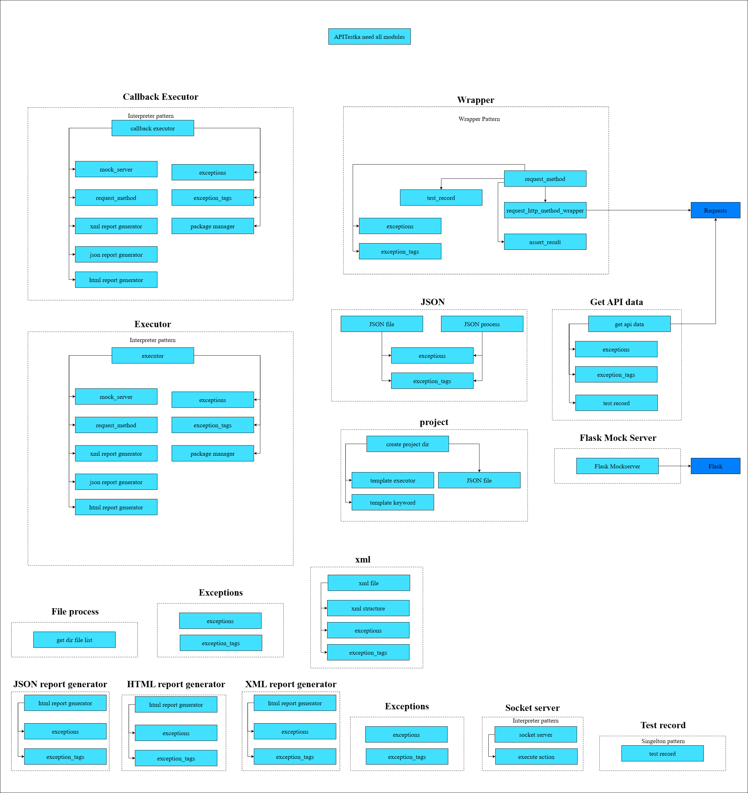

### APITestka

### Documentation

[APITestka Doc Click Here!](https://apitestka.readthedocs.io/en/latest/)

---
> Project Kanban \
> https://github.com/orgs/Integration-Automation/projects/2/views/1 \
> * API requests automation.
> * Data comparison for each Request.
> * API request in pure CLI mode.
> * Detailed reports on Requests and Responses.
> * HTTP/HTTPS support.
> * SOAP/XML support.
> * JSON support.
> * Generate JSON/HTML/XML report.
> * APITestka script.
> * 1 sec / thousands requests.
> * OS Independent.
> * Mockserver support.
> * Remote Automation support.
> * Project & Template support.
> * httpx Client(NEW)
> * httpx sync/async request.
> * http/2 request support. 

---

## install
> pip install je_api_testka

## Requires
> python 3.9 or later

### Architecture Diagram
